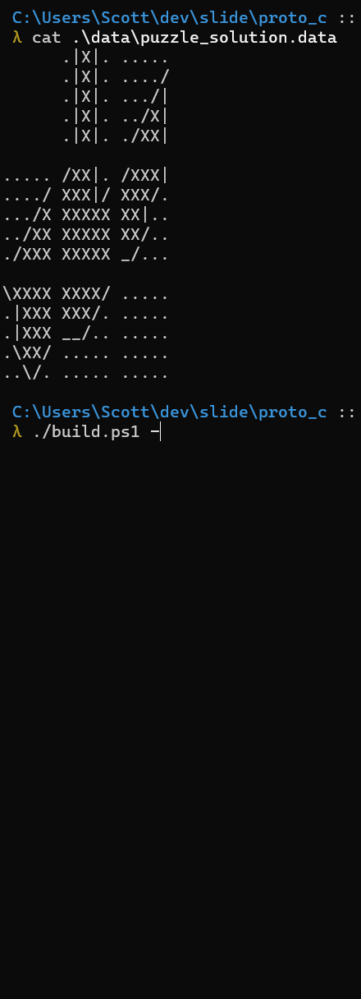

# Sliding-tile-puzzle

> **NOTE**: This project is abandoned. I haven't updated it in nearly a year and don't plan to anytime soon.

This project is a CLI version of one of those sliding block puzzle games written in C.

In 2021, I got really hooked on the idea of writing my own GBA game. This Windows-CLI prototype was meant to be
something that I would expand into my first real GBA project. I lost steam before ever making it to the GBA
programming phase of this project. I did write some GBA prototypes, but just never got around to making this a
proper GBA prototype and I don't think I plan to in the future. Oh well, sunrise... sunset...

Looking for silver linings, I did find it pretty cool to write a little CLI game that effectively renders its own
TUI interface by repainting the CLI using ascii control characters (i.e. the game updates characters on the terminal
screen rather than just writing new characters and scrolling the terminal).

I've used TUI libraries like ncurses in the past so this isn't totally new to me, but I found it cool to write from
scratch.

### Controls

Use your numpad (or your regular number keys) to move slide the tile in the corresponding cell.
```
| | | |
|-|-|-|
|1|2|3|
|4|5|6|
|7|8|9|
```

### Demo


